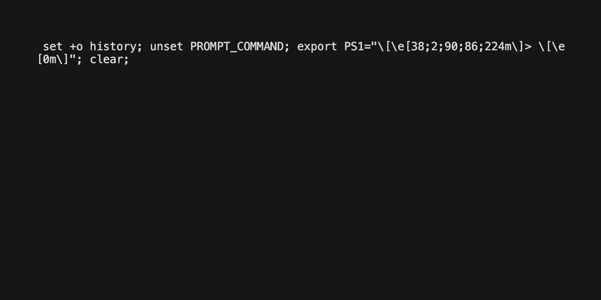

# terradoc.vim

> Terraform provider docs in Vim

## Overview

Searching through terraform provider docs on <https://registry.terraform.io> is
slow and unpleasant.

I prefer consuming docs locally, similar to `go doc` and `cargo doc`.

Fortunately, the terraform provider docs convention is to store docs in
`website/docs/*` (or `docs/*`) directory in the same repository as the provider
source code.

This vim plugin downloads the zipped repository locally and extracts only the
contents of `website/docs/*` (or `docs/*`) into
`/tmp/terradoc/<provider-repo>/<branch-or-version>/`, so you can enjoy the vim
goodness that we all know and love, like:

- Using vim's built-in `:grep "<regex>"`, then navigate through results with
  `:cnext`, `:cprev`, `:copen`, or `:Cfilter <regex>`
  - Or with [fzf.vim](https://github.com/junegunn/fzf.vim) plugin for
    interactive fuzzy searching in vim: `:Files`, `:Rg`, `:Tags`
- Using [glow](https://github.com/charmbracelet/glow) markdown viewer CLI
- Using VS Code with [Go to Symbol](https://code.visualstudio.com/Docs/editor/editingevolved#_go-to-symbol)

### Demo



_Recorded using [vhs](https://github.com/charmbracelet/vhs)_

## Install

Use your favorite vim plugin manager.

For example, using [vim-plug](https://github.com/junegunn/vim-plug):

```viml
Plug 'pbnj/terradoc.vim'
```

You may need to install additional dependencies if they don't exist on your system:

- `curl`
- `unzip`

## Usage

`:Terradoc` accepts the following arguments in this order:

- author: `hashicorp` (default), or any registry.terraform.io namespace, or
    github organization.
- provider: `aws` (default), `google`, `azure`, ...etc. Any provider from
    <https://registry.terraform.io/browse/providers> should work
- refs: `heads` (default) or `tags`. If downloading docs for a tagged version,
    choose `tags` then specify a version (see next argument)
- version: `main` (default) or `vX.Y.Z`

### Examples

```viml
:Terradoc
" will download the main branch of hashicorp/terraform-provider-aws repository,
" extract content of website/docs/*,
" and execute :Rg on it

:Terradoc digitalocean digitalocean tags v2.25.2
" will download v2.25.2 tagged branch of digitalocean/terraform-provider-digitalocean repository,
" extract content of docs/*,
" and execute :Rg on it
```

## Todo

- [ ] Vim docs
- [ ] Give users a better way to specify what to do with downloaded docs (e.g.
    `:Rg`/`:Files`, `:Explore`, other commands ...etc

## License

MIT
